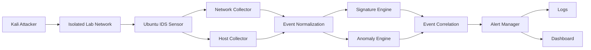

# Mini-IDS

A Python-based hybrid Host and Network Intrusion Detection System designed for security monitoring, detection engineering, and SOC-oriented analysis.

Mini-IDS is being developed from scratch to demonstrate how a lightweight IDS can collect security telemetry, normalize events, detect suspicious activity, correlate related events, and generate actionable alerts.

> **Project status:** Early development — network packet collection and event normalization are currently implemented.

---

## Project Overview

Mini-IDS is a modular Intrusion Detection System focused on combining network and host-based security telemetry into a common detection pipeline.

The project is designed as a practical cybersecurity portfolio project rather than a simple packet-sniffing script.

The long-term architecture separates:

- **Collection** — capture security telemetry.
- **Normalization** — convert raw telemetry into a common event schema.
- **Detection** — identify suspicious behavior using signatures and statistical anomalies.
- **Correlation** — combine related events into meaningful security incidents.
- **Alerting** — generate structured alerts for investigation.
- **Visualization** — provide a lightweight dashboard for security monitoring.

The system is being developed incrementally, validating each component before integrating the next one.

---

## Key Features

### Implemented

- Network packet capture using Scapy.
- Configurable network interface.
- Structured network event normalization.
- IPv4 protocol detection.
- TCP, UDP and ICMP event parsing.
- ARP event parsing.
- TCP flag extraction.
- Source and destination IP/port extraction.
- Unique event identifiers.
- UTC timestamps.
- Packet length tracking.
- Callback-based capture architecture.

### Planned

- Custom signature-based detection engine.
- YAML-based detection rules.
- Statistical anomaly detection.
- Host-based telemetry collection.
- Event correlation.
- Structured security alerts.
- JSON and SQLite logging.
- Detection testing with controlled attacks.
- SOC-oriented dashboard.
- Automated security testing and CI/CD.

---

## Architecture


The architecture separates telemetry collection from detection logic.

This allows the same normalized event model to be consumed by different detection engines without coupling packet capture directly to detection rules.

# Detection Pipeline

The intended processing model is:

```text
Collect telemetry
       ↓
Normalize raw data into structured security events
       ↓
Evaluate events using detection engines
       ↓
Correlate related detections
       ↓
Generate structured alerts
       ↓
Provide data for investigation and visualization
```

---

## Current Detection Capabilities

At the current development stage, **Mini-IDS implements network collection, event normalization, and signature-based detection**.

A captured network packet is converted into a structured event containing fields such as:

* `event_id`
* `event_type`
* `timestamp`
* `protocol`
* `src_ip`
* `src_port`
* `dst_ip`
* `dst_port`
* `tcp_flags`
* `packet_length`

### Example Normalized Event

```json
{
  "event_id": "8f7b1d9e-...",
  "event_type": "network",
  "timestamp": "2026-09-23T15:30:12.123456+00:00",
  "protocol": "TCP",
  "src_ip": "192.168.56.128",
  "src_port": 41234,
  "dst_ip": "192.168.56.129",
  "dst_port": 22,
  "tcp_flags": "S",
  "packet_length": 74
}
```

Detection logic is intentionally kept **outside the collector**.

The collector is responsible for:

1. Capturing network telemetry.
2. Extracting relevant packet information.
3. Normalizing raw data.
4. Generating structured security events.

Detection engines consume these normalized events independently.

### Implemented Signature Detections

#### NET-001 — TCP SYN Scan

Detects multiple TCP SYN packets from the same source to multiple destination ports on a target.

**Detection criteria:**

* Protocol: TCP
* TCP flags: SYN
* Minimum unique destination ports: 10
* Time window: 5 seconds
* Severity: Medium

The detection tracks the source and destination IP pair and generates a single alert when the configured threshold is reached.

#### NET-002 — SSH Brute Force

Detects multiple TCP SYN connection attempts from the same source to the same destination on TCP port 22 within a defined time window.

**Detection criteria:**

* Protocol: TCP
* TCP flags: SYN
* Destination port: 22
* Minimum connection attempts: 5
* Time window: 10 seconds
* Severity: High

The detection tracks the source and destination IP pair and generates a single alert when the configured threshold is reached.

Both signature detections have been validated with automated tests and controlled traffic in the isolated laboratory environment.

# Lab Environment

Mini-IDS is developed and tested in an **isolated virtualized security laboratory**.

```text
┌──────────────────────┐
│      Kali Linux      │
│   192.168.56.128     │
│                      │
│  Attack Simulation   │
└──────────┬───────────┘
           │
           │ VMnet1 / Host-only
           │
┌──────────▼───────────┐
│     Ubuntu Linux     │
│   192.168.56.129     │
│                      │
│    Mini-IDS Sensor   │
└──────────────────────┘
```

## Lab Roles

| System       | Role                        |
| ------------ | --------------------------- |
| Kali Linux   | Attack simulation           |
| Ubuntu Linux | IDS sensor                  |
| VMnet1       | Isolated laboratory network |

The laboratory network is isolated from the normal LAN to prevent test traffic from affecting external systems.

> **Security Notice:** All attack simulations are performed exclusively against systems owned and controlled by the project environment.

---

# Project Structure

```text
mini-ids/
├── config/
│   └── config.yaml
├── core/
│   ├── __init__.py
│   ├── capture.py
│   ├── signature_engine.py
│   ├── anomaly_engine.py
│   └── alert_manager.py
├── dashboard/
│   └── app.py
├── logs/
│   └── .gitkeep
├── rules/
│   └── signatures.yaml
├── tests/
│   └── __init__.py
├── .gitignore
├── README.md
└── requirements.txt
```

---

# Quick Start

## Requirements

The current development environment requires:

* Linux
* Python 3.12+
* Root privileges for packet capture
* Scapy
* An isolated test network

---

## Clone

```bash
git clone git@github.com:D4NYED/mini-ids.git
cd mini-ids
```

---

## Create the Virtual Environment

```bash
python3 -m venv .venv
```

---

## Install Dependencies

```bash
.venv/bin/pip install -r requirements.txt
```

---

## Start the Network Collector

```bash
sudo .venv/bin/python3 core/capture.py
```

The collector currently listens on the configured network interface and prints normalized network events.

---

# Configuration

The main configuration file is:

```text
config/config.yaml
```

## Current Configuration

```yaml
network:
  interface: ens36
  promiscuous: true

detection:
  enabled: true

logging:
  level: INFO
  file: logs/ids.log
```

The configured network interface should correspond to the **isolated IDS laboratory interface**.

---

# Detection Rules

Detection rules will be externalized from the Python detection engine.

The planned rule format is YAML:

```text
rules/signatures.yaml
```

The signature engine will use these rules to detect suspicious patterns such as:

* Port scanning
* SSH brute-force attempts
* Suspicious HTTP payloads
* Other network behaviors defined by the project's detection logic

The rules will contain **custom Mini-IDS detection logic** and will not depend on copied Snort or Suricata rule sets.

---

# Testing

Testing will be performed using controlled security scenarios inside the isolated laboratory.

## Planned Test Scenarios

* ICMP traffic
* TCP connection attempts
* Port scanning
* SSH authentication failures
* HTTP payload testing
* Network behavior deviations

Each detection scenario will be validated against the expected:

1. Normalized events
2. Detection results
3. Correlated events
4. Generated alerts

---

# Example Detection Flow

A future detection flow will look like:

```text
┌───────────┐
│   Kali    │
└─────┬─────┘
      │
      │ TCP SYN packets
      ▼
┌─────────────────┐
│  Ubuntu Sensor  │
└────────┬────────┘
         │
         │ Normalized network events
         ▼
┌─────────────────┐
│ Signature Engine│
└────────┬────────┘
         │
         │ Suspicious scan pattern
         ▼
┌─────────────────┐
│  Alert Manager  │
└────────┬────────┘
         │
         ▼
┌─────────────────┐
│ Security Alert  │
└─────────────────┘
```

---

## Example Alert

```json
{
  "alert_type": "port_scan",
  "severity": "medium",
  "source_ip": "192.168.56.128",
  "target_ip": "192.168.56.129",
  "evidence": {
    "unique_destination_ports": 15,
    "time_window_seconds": 5
  }
}
```

The exact detection thresholds will be documented when the corresponding detection engine is implemented and tested.

---

# Development Workflow

The project follows an incremental development workflow:

```text
Implement
   ↓
Test
   ↓
Validate
   ↓
Document
   ↓
Commit
```

Each major component is validated independently before being integrated into the detection pipeline.

---

# Code Quality

Planned development checks include:

* Unit testing with `pytest`
* Static analysis
* Security scanning
* Automated CI checks
* Detection regression tests

---

# Security Considerations

Mini-IDS is designed for:

* Defensive security research
* IDS development
* Security engineering experimentation
* Controlled laboratory testing

Attack simulations must only target systems owned by the operator or explicitly authorized test environments.

The project intentionally uses an **isolated virtual network** for offensive testing and IDS validation.

---

# Roadmap

## Phase 0 — Project Foundation

* [x] Repository structure
* [x] Python environment
* [x] Initial configuration
* [x] GitHub repository

---

## Phase 1 — Network Collection

* [x] Scapy integration
* [x] Packet capture
* [x] Protocol identification
* [x] TCP/UDP/ICMP parsing
* [x] ARP parsing
* [x] Event normalization
* [x] Unique event identifiers
* [x] UTC timestamps

---

## Phase 2 — Signature Detection

* [ ] Detection engine
* [ ] YAML rule format
* [ ] Port scan detection
* [ ] SSH brute-force detection
* [ ] Suspicious HTTP payload detection

---

## Phase 3 — Anomaly Detection

* [ ] Traffic baseline
* [ ] Statistical deviation detection
* [ ] Threshold management
* [ ] Anomaly alerts

---

## Phase 4 — Correlation & Alerting

* [ ] Event correlation
* [ ] Incident timelines
* [ ] Alert severity
* [ ] Structured security logging

---

## Phase 5 — Host Detection

* [ ] Authentication event collection
* [ ] SSH monitoring
* [ ] Process/network telemetry
* [ ] Host event normalization

---

## Phase 6 — Visualization

* [ ] Flask dashboard
* [ ] Alert overview
* [ ] Event timeline
* [ ] Detection statistics

---

## Phase 7 — Engineering & Documentation

* [ ] Unit tests
* [ ] Integration tests
* [ ] Security scanning
* [ ] GitHub Actions
* [ ] Detection regression tests
* [ ] Complete technical documentation

---

# Project Status

**Current status: Active development**

The network collection and event normalization layer is operational and has been validated against controlled:

* ICMP traffic
* ARP traffic
* TCP traffic

within the isolated laboratory environment.

The **detection engines represent the next major development stage**.

---

# License

This project is intended for **educational, research, and defensive security purposes**.

See [`LICENSE`](LICENSE) for the project license.
