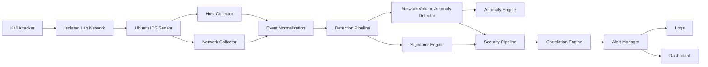

# Mini-IDS

A Python-based hybrid Host and Network Intrusion Detection System designed for security monitoring, detection engineering, and SOC-oriented analysis.

Mini-IDS is being developed from scratch to demonstrate how a lightweight IDS can collect security telemetry, normalize events, detect suspicious activity, correlate related events, and generate actionable alerts.

> **Project status:** Active development — network collection, event normalization, signature-based detection, and statistical anomaly detection are implemented and validated with controlled laboratory traffic. Alert correlation and security pipeline orchestration are implemented and unit tested; integration with live packet capture is the next development step.

---

## Project Overview

Mini-IDS is a modular Intrusion Detection System focused on combining network and host-based security telemetry into a common detection pipeline.

The project is designed as a practical cybersecurity portfolio project rather than a simple packet-sniffing script.

The long-term architecture separates:

- **Collection** — capture security telemetry.
- **Normalization** — convert raw telemetry into a common event schema.
- **Detection** — identify suspicious behavior using signatures and statistical anomalies.
- **Correlation** — combine related events into meaningful security incidents.
- **Alerting** — generate structured alerts for investigation.
- **Visualization** — provide a lightweight dashboard for security monitoring.

The system is being developed incrementally, validating each component before integrating the next one.

---

## Key Features

### Implemented

- Network packet capture using Scapy.
- Packet capture on the dedicated isolated laboratory network interface.
- Structured network event normalization.
- IPv4 protocol detection.
- TCP, UDP and ICMP event parsing.
- ARP event parsing.
- TCP flag extraction.
- Source and destination IP/port extraction.
- Unique event identifiers.
- UTC timestamps.
- Packet length tracking.
- Callback-based capture architecture.
- Custom signature-based detection engine.
- YAML-based signature rules.
- TCP SYN scan detection.
- SSH brute-force detection.
- Suspicious HTTP payload detection.
- Statistical anomaly detection using a learned baseline.
- Network event volume anomaly detection.
- Configurable anomaly thresholds and measurement windows.
- Unified detection pipeline for signature and anomaly engines.
- Alert correlation engine.
- COR-001 correlation: reconnaissance followed by SSH brute force.
- Security pipeline orchestration for detection and correlation.
- Automated unit and integration tests with pytest.

### Planned

- Integration of the SecurityPipeline with live packet capture.
- Host-based telemetry collection.
- Additional correlation rules.
- Incident timelines.
- Alert Manager.
- Structured JSON and SQLite logging.
- SOC-oriented dashboard.
- Automated security testing and CI/CD.

---

## Architecture


```mermaid
flowchart LR
    A[Kali Attacker] --> B[Isolated Lab Network]
    B --> C[Ubuntu IDS Sensor]

    C --> D[Network Collector]
    C --> E[Host Collector]

    D --> F[Event Normalization]
    E --> F

    F --> G[Detection Pipeline]

    G --> H[Signature Engine]
    G --> I[Network Volume Anomaly Detector]

    I --> J[Anomaly Engine]

    H --> K[Security Pipeline]
    I --> K

    K --> L[Correlation Engine]
    L --> M[Alert Manager]

    M --> N[Logs]
    M --> O[Dashboard]
```
The architecture separates telemetry collection from detection logic.

This allows the same normalized event model to be consumed by different detection engines without coupling packet capture directly to detection rules.

# Detection Pipeline

The current live network processing flow is:

```text
Collect network telemetry
      ↓
Normalize raw packets into structured security events
      ↓
DetectionPipeline
      ├── SignatureEngine
      └── NetworkVolumeAnomalyDetector
              ↓
          AnomalyEngine
      ↓
Generate structured detection alerts
```

---

## Current Detection Capabilities

At the current development stage, **Mini-IDS implements network collection, event normalization, signature-based detection, statistical anomaly detection, and alert correlation**.

Signature-based and anomaly-based detections are integrated into the live network processing flow through the `DetectionPipeline`. Alert correlation is implemented and unit tested through the `CorrelationEngine`, but has not yet been integrated with live packet capture.

A captured network packet is converted into a structured event containing fields such as:

* `event_id`
* `event_type`
* `timestamp`
* `protocol`
* `src_ip`
* `src_port`
* `dst_ip`
* `dst_port`
* `tcp_flags`
* `packet_length`

### Example Normalized Event

```json
{
  "event_id": "8f7b1d9e-...",
  "event_type": "network",
  "timestamp": "2026-09-23T15:30:12.123456+00:00",
  "protocol": "TCP",
  "src_ip": "192.168.56.128",
  "src_port": 41234,
  "dst_ip": "192.168.56.129",
  "dst_port": 22,
  "tcp_flags": "S",
  "packet_length": 74
}
```

Detection logic is intentionally kept **outside the collector**.

The collector is responsible for:

1. Capturing network telemetry.
2. Extracting relevant packet information.
3. Normalizing raw data.
4. Generating structured security events.

Detection engines consume these normalized events independently.

### Implemented Signature Detections

#### NET-001 — TCP SYN Scan

Detects multiple TCP SYN packets from the same source to multiple destination ports on a target.

**Detection criteria:**

* Protocol: TCP
* TCP flags: SYN
* Minimum unique destination ports: 10
* Time window: 5 seconds
* Severity: Medium

The detection tracks the source and destination IP pair and generates a single alert when the configured threshold is reached.

#### NET-002 — SSH Brute Force

Detects multiple TCP SYN connection attempts from the same source to the same destination on TCP port 22 within a defined time window.

**Detection criteria:**

* Protocol: TCP
* TCP flags: SYN
* Destination port: 22
* Minimum connection attempts: 5
* Time window: 10 seconds
* Severity: High

The detection tracks the source and destination IP pair and generates a single alert when the configured threshold is reached.

Both signature detections have been validated with automated tests and controlled traffic in the isolated laboratory environment.

#### NET-003 — Suspicious HTTP Payload

Detects suspicious command injection patterns contained in HTTP request payloads.

**Detection criteria:**

* Protocol: HTTP
* Payload inspection: enabled
* Suspicious patterns:
  * `; /bin/sh`
  * `; /bin/bash`
* Severity: High

The detection inspects normalized HTTP payloads and generates an alert when a configured suspicious pattern is found.

The current implementation focuses on literal payload pattern matching. URL-encoded or fragmented payloads are not currently decoded or reassembled before inspection.

The detection has been validated with automated tests and controlled HTTP traffic in the isolated laboratory environment.

### Implemented Statistical Anomaly Detection

#### NET-004 — Network Event Volume Anomaly

Detects abnormal increases in the total volume of network events observed by the IDS sensor.

The detector groups normalized network events into fixed measurement windows and uses an initial learning phase to establish a statistical baseline.

**Detection criteria:**

* Measurement: total normalized network events.
* Measurement window: 10 seconds.
* Baseline samples: 10 measurements.
* Threshold multiplier: 3.
* Detection condition: current measurement must exceed the calculated threshold.
* Severity: Medium.

The threshold is calculated as:

```text
threshold = baseline × threshold_multiplier
```

During the initial learning phase, measurements are collected without generating anomaly alerts.

Once the baseline has been established, new measurements are compared against the threshold.

A generated NET-004 alert includes:

* Detector ID and name.
* Severity.
* Detection timestamp.
* Metric name.
* Baseline value.
* Current measurement.
* Calculated threshold.
* Measurement window duration.

NET-004 has been validated with automated tests and controlled network traffic in the isolated laboratory environment.

During laboratory validation, the detector successfully identified a network event volume increase above the learned baseline.

**Current limitations:**

* The baseline is created during the initial learning phase and remains fixed.
* Completely empty measurement windows are not currently emitted as zero-value measurements.
* The detector measures total network event volume and does not currently separate measurements by protocol, source IP, or destination IP.

### Implemented Alert Correlation

#### COR-001 — Reconnaissance Followed by SSH Brute Force

Correlates a TCP SYN scan alert with a subsequent SSH brute-force alert when both detections appear to belong to the same attacker-to-target sequence.

**Correlation criteria:**

* First alert: `NET-001` — TCP SYN Scan.
* Second alert: `NET-002` — SSH Brute Force.
* Same source IP.
* Same destination IP.
* NET-002 must occur after NET-001.
* Maximum correlation window: 60 seconds.
* Incident severity: High.

When all criteria are satisfied, the `CorrelationEngine` generates a higher-level incident identified as:

```text
COR-001 — Reconnaissance Followed by SSH Brute Force
```

The correlation rule has been validated with automated tests covering successful correlation, correlation-window expiration, different source addresses, different destination addresses, and incorrect alert ordering.

The `CorrelationEngine` and `SecurityPipeline` are currently implemented and unit tested. Integration with the live packet capture flow is the next development step.

# Lab Environment

Mini-IDS is developed and tested in an **isolated virtualized security laboratory**.

```text
┌──────────────────────┐
│      Kali Linux      │
│   192.168.56.128     │
│                      │
│  Attack Simulation   │
└──────────┬───────────┘
           │
           │ VMnet1 / Host-only
           │
┌──────────▼───────────┐
│     Ubuntu Linux     │
│   192.168.56.129     │
│                      │
│    Mini-IDS Sensor   │
└──────────────────────┘
```

## Lab Roles

| System       | Role                        |
| ------------ | --------------------------- |
| Kali Linux   | Attack simulation           |
| Ubuntu Linux | IDS sensor                  |
| VMnet1       | Isolated laboratory network |

The laboratory network is isolated from the normal LAN to prevent test traffic from affecting external systems.

> **Security Notice:** All attack simulations are performed exclusively against systems owned and controlled by the project environment.

---

# Project Structure

```text
mini-ids/
├── config/
│   └── config.yaml
├── core/
│   ├── __init__.py
│   ├── alert_manager.py
│   ├── anomaly_engine.py
│   ├── capture.py
│   ├── config.py
│   ├── correlation_engine.py
│   ├── detection_pipeline.py
│   ├── measurement_window.py
│   ├── network_volume_detector.py
│   ├── security_pipeline.py
│   └── signature_engine.py
├── dashboard/
│   └── app.py
├── logs/
│   └── .gitkeep
├── rules/
│   └── signatures.yaml
├── tests/
│   ├── __init__.py
│   ├── test_anomaly_engine.py
│   ├── test_capture.py
│   ├── test_correlation_engine.py
│   ├── test_detection_pipeline.py
│   ├── test_measurement_window.py
│   ├── test_network_volume_detector.py
│   ├── test_security_pipeline.py
│   └── test_signature_engine.py
├── .gitignore
├── README.md
└── requirements.txt
```

---

# Quick Start

## Requirements

The current development environment requires:

* Linux
* Python 3.12+
* Root privileges for packet capture
* Scapy
* An isolated test network

---

## Clone

```bash
git clone git@github.com:D4NYED/mini-ids.git
cd mini-ids
```

---

## Create the Virtual Environment

```bash
python3 -m venv .venv
```

---

## Install Dependencies

```bash
.venv/bin/pip install -r requirements.txt
```

---

## Start the Network Sensor

Run Mini-IDS from the project root using Python module execution:

```bash
sudo .venv/bin/python3 -m core.capture
```

The sensor captures packets from the configured laboratory interface, normalizes them into structured network events, and sends them through the live `DetectionPipeline`.

The current live detection flow includes:

- Signature-based detection.
- Statistical network volume anomaly detection.
- Structured detection alerts printed to the terminal.

The `SecurityPipeline` and `CorrelationEngine` are implemented and tested independently, but are not yet connected to the live packet capture flow.

---

# Configuration

The main configuration file is:

```text
config/config.yaml
```

## Current Configuration

```yaml
detection:
  enabled: true

anomaly:
  enabled: true
  window_seconds: 10
  baseline_samples: 10
  threshold_multiplier: 3
```

The anomaly configuration controls the behavior of the statistical network volume detector:

- `enabled` — configuration flag reserved for anomaly detection; runtime enable/disable handling is not yet wired into the live capture flow.
- `window_seconds` — duration of each network event measurement window.
- `baseline_samples` — number of measurements required during the initial learning phase.
- `threshold_multiplier` — multiplier applied to the learned baseline to calculate the anomaly threshold.

The current statistical threshold is calculated as:

```text
threshold = baseline × threshold_multiplier
```

The IDS network interface is currently defined in `core/capture.py` and is not yet loaded from `config/config.yaml`.

---

# Detection Rules

Signature-based detection rules are externalized in:

```text
rules/signatures.yaml
```

The `SignatureEngine` loads these YAML rules and applies the configured detection logic to normalized network events.

The current rule set includes:

- `NET-001` — TCP SYN Scan.
- `NET-002` — SSH Brute Force.
- `NET-003` — Suspicious HTTP Payload.

The YAML rules define metadata such as:

- Rule ID.
- Name.
- Description.
- Severity.
- Enabled state.
- Detection criteria.
- Thresholds.
- Suspicious payload patterns.

The project uses **custom Mini-IDS detection logic** and does not depend on copied Snort or Suricata rule sets.

Statistical anomaly detection is implemented separately from the signature rule system. `NET-004` uses runtime configuration from `config/config.yaml` rather than a YAML signature rule.

---

# Testing

Mini-IDS uses automated tests and controlled laboratory traffic to validate detection behavior.

The current test suite contains:

```text
23 passing tests
```

The automated tests currently cover:

- Network packet normalization.
- TCP SYN scan detection (`NET-001`).
- SSH brute-force detection (`NET-002`).
- Suspicious HTTP payload detection (`NET-003`).
- Statistical baseline creation.
- Anomaly threshold evaluation.
- Measurement window behavior.
- Network event volume anomaly detection (`NET-004`).
- Detection pipeline orchestration.
- Alert correlation (`COR-001`).
- Security pipeline orchestration.

## Controlled Laboratory Validation

The IDS has also been validated using controlled traffic inside the isolated laboratory environment.

Validated scenarios include:

- ICMP traffic.
- ARP traffic.
- TCP connection attempts.
- TCP SYN scanning.
- SSH brute-force behavior.
- Suspicious HTTP payloads.
- Network event volume deviations.

NET-004 was validated with live laboratory traffic and successfully generated an anomaly alert when the measured network event volume exceeded the learned statistical threshold.

All offensive security simulations are performed exclusively against systems owned and controlled by the laboratory environment.

## Validation Workflow

Each component follows the same incremental validation process:

```text
Implement
   ↓
Unit test
   ↓
Integration test
   ↓
Controlled laboratory validation
   ↓
Document
   ↓
Commit
```

Not every component has reached every validation stage. For example, the `SecurityPipeline` and `CorrelationEngine` are currently unit tested but have not yet been integrated into the live packet capture flow.

---

# Example Detection Flow

The current live network detection flow is:

```text
┌───────────────┐
│  Kali Attacker│
└───────┬───────┘
        │
        │ Network traffic
        ▼
┌──────────────────┐
│  Ubuntu IDS      │
│  Sensor          │
└────────┬─────────┘
         │
         │ Captured packets
         ▼
┌──────────────────┐
│ Event            │
│ Normalization    │
└────────┬─────────┘
         │
         │ Structured network events
         ▼
┌──────────────────┐
│ DetectionPipeline│
└───────┬──────────┘
        │
        ├───────────────► SignatureEngine
        │                  ├── NET-001
        │                  ├── NET-002
        │                  └── NET-003
        │
        └───────────────► NetworkVolumeAnomalyDetector
                           └── AnomalyEngine
                               └── NET-004
```

The next integration stage extends this flow with security orchestration and correlation:

```text
DetectionPipeline
      ↓
alerts
      ↓
SecurityPipeline
      ↓
CorrelationEngine
      ↓
incidents
```

The `SecurityPipeline` and `CorrelationEngine` are already implemented and unit tested, but this correlation path has not yet been connected to the live packet capture workflow.

---

## Example Alerts

Mini-IDS generates structured alerts that include detection metadata and evidence explaining why the detection was triggered.

### Signature Alert Example

```json
{
  "signature_id": "NET-001",
  "signature_name": "TCP SYN Scan",
  "severity": "medium",
  "timestamp": "2026-10-10T16:30:12.123456+00:00",
  "src_ip": "192.168.56.128",
  "dst_ip": "192.168.56.129",
  "evidence": {
    "unique_destination_ports": 12,
    "time_window_seconds": 5
  }
}
```

### Statistical Anomaly Alert Example

```json
{
  "type": "anomaly",
  "detector_id": "NET-004",
  "detector_name": "Network Event Volume Anomaly",
  "severity": "medium",
  "timestamp": "2026-10-10T16:31:00.000000+00:00",
  "evidence": {
    "metric": "network_event_count",
    "baseline": 5.3,
    "current_value": 27,
    "threshold": 15.9,
    "window_seconds": 10
  }
}
```

The `evidence` field contains the technical context used to explain why the corresponding detection was generated.

Signature alerts and anomaly alerts currently use slightly different schemas because they originate from different detection mechanisms. Further alert normalization may be introduced later if required by the Alert Manager.

---

# Development Workflow

The project follows an incremental development workflow:

```text
Implement
   ↓
Test
   ↓
Validate
   ↓
Document
   ↓
Commit
```

Each major component is validated independently before being integrated into the detection pipeline.

---

# Code Quality

The project currently uses:

- Automated testing with `pytest`.
- Unit tests for individual detection components.
- Integration tests between detection, anomaly, correlation, and orchestration components.
- Controlled laboratory validation for implemented network detections.

Planned engineering improvements include:

- Static analysis.
- Security scanning.
- GitHub Actions.
- Automated CI checks.
- Extended detection regression testing.

---

# Security Considerations

Mini-IDS is designed for:

* Defensive security research
* IDS development
* Security engineering experimentation
* Controlled laboratory testing

Attack simulations must only target systems owned by the operator or explicitly authorized test environments.

The project intentionally uses an **isolated virtual network** for offensive testing and IDS validation.

---

# Roadmap

## Phase 0 — Project Foundation

- [x] Repository structure
- [x] Python environment
- [x] Initial configuration
- [x] GitHub repository

---

## Phase 1 — Network Collection

- [x] Scapy integration
- [x] Packet capture
- [x] Protocol identification
- [x] TCP/UDP/ICMP parsing
- [x] ARP parsing
- [x] Event normalization
- [x] Unique event identifiers
- [x] UTC timestamps

---

## Phase 2 — Signature Detection

- [x] Signature detection engine
- [x] YAML rule format
- [x] NET-001 — TCP SYN Scan
- [x] NET-002 — SSH Brute Force
- [x] NET-003 — Suspicious HTTP Payload
- [x] Controlled laboratory validation

---

## Phase 3 — Statistical Anomaly Detection

- [x] Measurement window
- [x] Initial traffic baseline
- [x] Learning phase
- [x] Statistical deviation detection
- [x] Configurable threshold multiplier
- [x] NET-004 — Network Event Volume Anomaly
- [x] Structured anomaly alerts
- [x] DetectionPipeline integration
- [x] Controlled laboratory validation

---

## Phase 4 — Correlation & Alerting

- [x] Correlation engine
- [x] COR-001 — Reconnaissance Followed by SSH Brute Force
- [x] Correlation time-window validation
- [x] Source and destination correlation
- [x] SecurityPipeline orchestration
- [ ] Integrate SecurityPipeline with live packet capture
- [ ] Additional correlation rules
- [ ] Incident timelines
- [ ] Alert Manager
- [ ] Structured JSON and SQLite logging

---

## Phase 5 — Host Detection

- [ ] Authentication event collection
- [ ] SSH monitoring
- [ ] Process/network telemetry
- [ ] Host event normalization
- [ ] Host-based detection rules

---

## Phase 6 — Visualization

- [ ] Flask dashboard
- [ ] Alert overview
- [ ] Incident timeline
- [ ] Detection statistics

---

## Phase 7 — Engineering & Documentation

- [x] Automated tests with pytest
- [x] Component integration tests
- [x] Controlled laboratory validation
- [ ] Static analysis
- [ ] Security scanning
- [ ] GitHub Actions
- [ ] Automated CI checks
- [ ] Extended detection regression testing
- [ ] Complete technical documentation

---

# Project Status

**Current status: Active development**

Mini-IDS currently provides a working network-based detection pipeline with:

- Network packet capture and event normalization.
- Signature-based detection.
- Statistical anomaly detection.
- Structured detection alerts.
- Alert correlation.
- Security pipeline orchestration.

The following detections are currently implemented:

- `NET-001` — TCP SYN Scan.
- `NET-002` — SSH Brute Force.
- `NET-003` — Suspicious HTTP Payload.
- `NET-004` — Network Event Volume Anomaly.

The following correlation rule is currently implemented:

- `COR-001` — Reconnaissance Followed by SSH Brute Force.

The project currently has:

```text
23 passing automated tests
```

Signature-based detection, statistical anomaly detection, and the live `DetectionPipeline` have been validated with controlled traffic inside the isolated laboratory environment.

The `CorrelationEngine` and `SecurityPipeline` are implemented and unit tested. The next development step is to integrate the `SecurityPipeline` with the live packet capture flow so that detected alerts can be correlated into incidents during runtime.

Host-based telemetry collection, Alert Manager integration, structured persistent logging, dashboard visualization, and CI/CD automation remain planned development stages.

---

# License

This project is intended for **educational, research, and defensive security purposes**.

See [`LICENSE`](LICENSE) for the project license.
